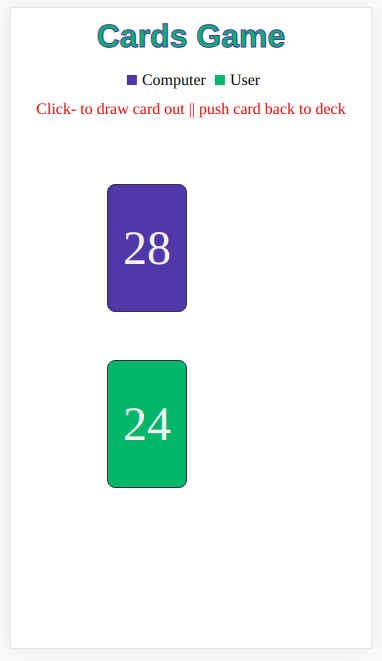
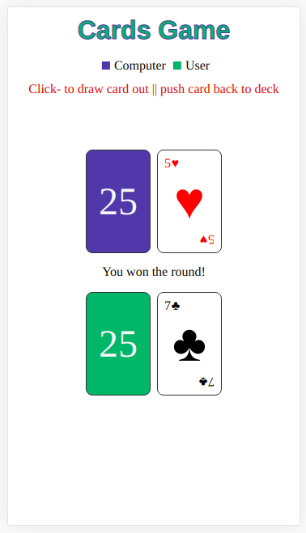

#Cards Game - JS
###Desc

- At the start, deck is shuffled and split into two halves, 26 cards for User and Computer.
- User have to click anywhere, to draw his card from deck, computer's card will be automatically drawn.
- Result will be shown in the middle and if user wins, both cards will be added to user's deck, else, both will be added to computer's deck.

### ScreenShots

